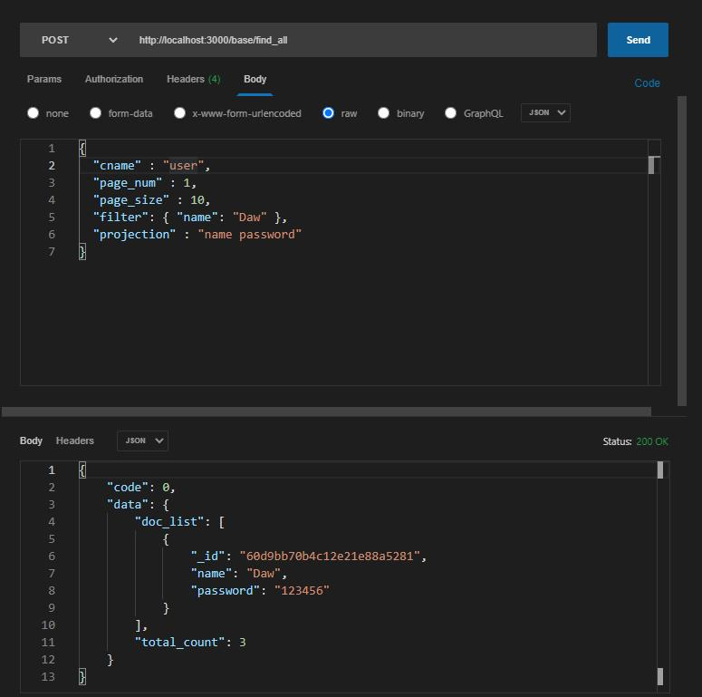
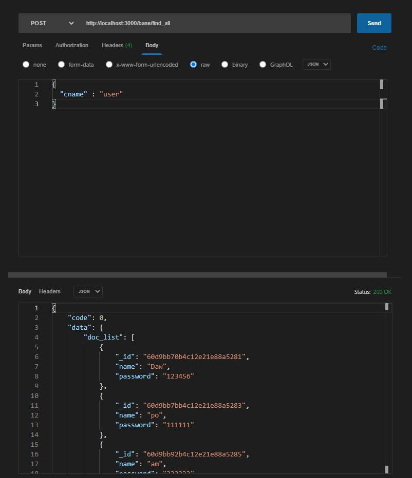

### koa-data （mongodb）

> koa-data是一个基于node的cli工具，可以生成一个koa后台服务，可以选择性的生成router模板和数据库模板（mongoose库和一些通用性的操作接口），一套接口可以操作多个表，动态传递表名即可，可以让你快速的进行开发和调试。

### 工具使用

1. 安装  
  npm install koa-data -g

2. 执行命令  
  koa-data

3. 输入配置  
  packageName 文件名、port 项目启动端口、router路由和mongodb


### 项目启动

> 进入生成的项目目录，执行命令 node index.js

### 接口使用和调试


- config文件是配置文件，可以配置mongodb的地址和项目运行端口，可以根据环境自行修改

- 项目启动后，可以调用基础的路由测试接口验证，地址：http://localhost:3000/base/test

- mongodb操作接口

```js
// 插入 http://localhost:3000/base/insert_one
{
  "cname" : "user", // 表名
  "doc" : {   // 字段
    "name" : "Daw",
    "password" : "123456"
  }
}

// 指定id删除表中一项 /base/delete_one
{
  "cname" : "user", // 表名
  "_id" : "5eef0ebea1ddd4ed2446c673"
}
// 删除表中全部项 /base/delete_all
{
  "cname" : "user"
}

// 更新（准确来说应该是替换） /base/replace_one
{
  "cname" : "user", // 表名
  "_id" : "5eef0ebea1ddd4ed2446c673",
  "doc" : {
    "name" : "Daw1",
    "password" : "456789"
  }
}

// 根据id查询一条数据 /base/find_one
{
  "cname" : "user", // 表名
  "_id" : "5eef0ebea1ddd4ed2446c673"
}
// 查询多条数据（可分页，过滤，筛选响应字段） /base/find_all
{
  "cname" : "user", // 表名
  "page_num" : 1, // 第一页
  "page_size" : 10, // 每页10条
  "filter": { "name": "Daw" }, // 过滤name: "Daw"
  "projection" : "name password"  // 查询结果只返回这两字段
}
```
**当然了查询多条数据的接口条件时可选的，可以不填或选填，具体看下面的图**



**不限定条件，返回所有表中数据**




### **最后**

欢迎来互动，另外这个项目帮助到你的话，希望你可以顺手点个 **[star](https://github.com/iamwhj/koa-data)**。